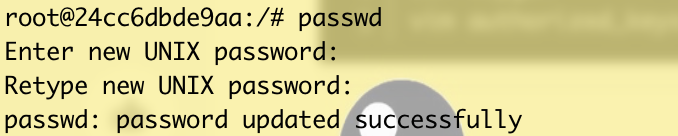

## 容器打开GPU和挂载硬盘

容器如果需要使用GPU训练，需要打开GPU的权限。

需要bind一个硬盘上的文件到docker内部，将docker的文件放入那个文件中。这样的话，所有文件就会保存在硬盘的那个文件当中。

~~~ she
docker run -itd --gpus all --restart=always --shm-size=80g -p 15555:22 -p 15556:8888 -v /fast-labpool/tyc:/notebooks /mnt/nfs-ssd:/notebooks/publicdata --name=tyc_pytorch tyc:v1
~~~

## 创建容器可以远程连接SSH

1、创建并运行容器

docker run -itd  --name tyc -p  9091:22  -p 9090:9090  ubuntu:18.04

2、进入容器

docker exec -it tyc bash

3、容器内部安装ssh

```csharp
apt-get update
apt-get install ssh
ssh-keygen
vim authorized_keys
```

4、配置ssh `vim /etc/ssh/sshd_config`

```undefined
PermitRootLogin yes
AuthorizedKeysFile  /root/.ssh/authorized_keys
PasswordAuthentication no
```

5、启动sshd

```undefined
service ssh start
```

6、创建root用户密码

~~~ 
passwd
~~~



7、关闭服务器上的防火墙

云服务器是在服务界面开启一个端口