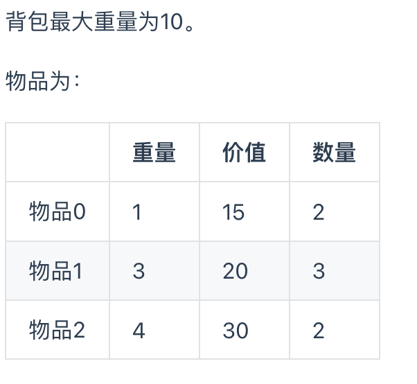

# 动态规划理论基础


动态规划，英文：Dynamic Programming，简称DP，如果某一问题有很多重叠子问题，使用动态规划是最有效的。

所以动态规划中每一个状态一定是由上一个状态推导出来的，**这一点就区分于贪心**，贪心没有状态推导，而是从局部直接选最优的，

## DP的五步解题步骤

状态转移公式（递推公式）是很重要，但动规不仅仅只有递推公式。

**对于动态规划问题，我将拆解为如下五步曲，这五步都搞清楚了，才能说把动态规划真的掌握了！**

1. 确定dp数组（dp table）以及下标的含义
2. 确定递推公式
3. dp数组如何初始化
4. 确定遍历顺序
5. 举例推导dp数组

一些同学可能想为什么要先确定递推公式，然后在考虑初始化呢？

**因为一些情况是递推公式决定了dp数组要如何初始化！**


# 基础题目

基础题目不加思路了。

斐波那契数[力扣题目链接](https://leetcode-cn.com/problems/fibonacci-number/)

爬楼梯[力扣题目链接](https://leetcode-cn.com/problems/climbing-stairs/)

使用最小花费爬楼梯[力扣题目链接](https://leetcode-cn.com/problems/min-cost-climbing-stairs/)

不同路径[力扣题目链接](https://leetcode-cn.com/problems/unique-paths/)

不同路径2[力扣题目链接](https://leetcode-cn.com/problems/unique-paths-ii/)（有障碍物）

整数拆分[力扣题目链接](https://leetcode-cn.com/problems/integer-break/)

不同的二叉搜索树 [力扣题目连接](https://leetcode.cn/problems/unique-binary-search-trees/)

# 背包问题


## 01背包

有n件物品和一个最多能背重量为w 的背包。第i件物品的重量是weight[i]，得到的价值是value[i] 。**每件物品只能用一次**，求解将哪些物品装入背包里物品价值总和最大。

暴力法：每一件物品其实只有两个状态，取或者不取，所以可以使用回溯法搜索出所有的情况，那么时间复杂度就是$o(2^n)$，这里的n表示物品数量。**所以暴力的解法是指数级别的时间复杂度。进而才需要动态规划的解法来进行优化！**


### 二维dp数组01背包


dp[i[j] 表示从下标为[0-i]的物品里任意取，放进容量为j的背包，价值总和最大是多少。


再回顾一下dp【i】[j]的含义：从下标为[0-i]的物品里任意取，放进容量为j的背包，价值总和最大是多少。

那么可以有两个方向推出来dp【i】[j]，

- **不放物品i**：由dp【i - 1】【j】推出，即背包容量为j，里面不放物品i的最大价值，此时dp【i】【j】就是dp【i - 1】【j】。(其实就是当物品i的重量大于背包j的重量时，物品i无法放进背包中，所以被背包内的价值依然和前面相同。)
- **放物品i**：由dp【i - 1】【j】推出，dp【i - 1】【j】为背包容量为j - weight【i】的时候不放物品i的最大价值，那么dp【i - 1】【j】+ value[i] （物品i的价值），就是背包放物品i得到的最大价值

所以递归公式： dp【i】【j】 = max(dp【i - 1】【j】, dp【i - 1】【j - weight[i]】 + value[i]);

### 将背包改为一维数组

**遍历顺序需要从后往前保证了物品i只被放入了一次。一旦正序遍历，那么物品0就会被重复加入很多次。**

01背包问题有相同的代码套路，最重要的是要找出这道题目是一个01背包问题。

然后按照上述的方法来构造代码。

~~~ python
# 构造dp数组
# 一般都需要加1，根据具体情况分析
# 构造一维数组的情况
dp = [[0] * (n+1) for _ in range(m+1)] # 防止浅拷贝问题

# 遍历物体的个数
for i in range(m+1):
  # 需要从后往前遍历，遍历背包的容量。
  for j in range(n, -1, -1):
    # 添加递归公式
    dp[j] = max(dp[j], dp[j - weight[i]] + value[i]);
~~~

### 背包问题题目

### 分割等和子集[力扣题目链接(opens new window)](https://leetcode-cn.com/problems/partition-equal-subset-sum/)

### 最后一块石头的重量2

[力扣题目链接](https://leetcode-cn.com/problems/last-stone-weight-ii/)

主要需要想到，将一堆石头分为两个部分，然后石头放入一堆当中。然后与目标值的两倍差值就是最终需要求的答案。

### 目标和

[力扣题目链接](https://leetcode.cn/problems/target-sum/)

还是一个构造背包的问题。01背包问题最难的是想到如何构造出背包。

而且这道题是计算有多少种方法，可以理解为**组合问题**，需要将递推公式改为累加。

~~~ python
class Solution:
    def findTargetSumWays(self, nums: List[int], target: int) -> int:
        # 加法总和和减法总和，构成最终的结果
        # x - (Sum-x)=target
        # 背包的容量大小为 x= Sum+target /2
        if (sum(nums) + target)%2 == 1 or (sum(nums)+target)<0:
            return 0
        x = int((sum(nums)+ target)/2)
				dp = [1]+[0]*x
        for j in range(x+1):
            if j == nums[0]:
                dp[j] += 1
                break
        for i in range(1, len(nums)):
            for j in range(x, -1, -1):
                if j >= nums[i]:
                    dp[j] += dp[j-nums[i]]	# 有多少种组合，所以要改为累加。
        return dp[-1]
~~~


### 一和零

[力扣题目链接](https://leetcode.cn/problems/ones-and-zeroes/)

二维的01背包，虽然有两个限制，但是本质上还是可以用01背包的方法。

~~~ python
dp = [[0] * (n+1) for _ in range(m+1)]
# 遍历物品
for str in strs:
  zero_nums = str.count('0')
  one_nums = str.count('1')
  # 需要从后往前遍历 这边变为了二维的背包。
  # 遍历到zero_nums-1 就停止，是个小track
  for i in range(m, zero_nums-1, -1):
    for j in range(n, one_nums-1, -1):
      dp[i][j] = max(dp[i][j], dp[i-zero_nums][j-one_nums]+1)
  return dp[m][n]
~~~

## 完全背包问题

完全背包的物品可以重复添加很多次，所以从小到大遍历。

~~~ python
// 先遍历物品，再遍历背包
for(int i = 0; i < weight.size(); i++) { // 遍历物品
		# 从小到大遍历	使得物体可以重复放入
    for(int j = weight[i]; j <= bagWeight ; j++) { // 遍历背包容量
        dp[j] = max(dp[j], dp[j - weight[i]] + value[i]);
    }
}
~~~


### 零钱兑换

[力扣题目链接](https://leetcode.cn/problems/coin-change-2/)

这边是一个计算有多少种组合的题。计算组合的题目，在确定递推公式的时候，不能采用max取得dp[j]和dp[j-weight[i]]的最大值，而需要采用**累加的方式**计算有多少组合。

~~~python
class Solution:
    def change(self, amount: int, coins: List[int]) -> int:
        # 背包的容量为amount 需要放入的物品为coins
        dp = [1] + [0] * amount
        for i in coins:
            for j in range(i, amount+1):	# 需要正向遍历，这样可以不使得元素可以重复放入。
                dp[j] += dp[j-i]	# 这边需要采用累加的方式计算有多少种组合
        return dp[-1]
~~~

### 377.组合总和IV

[力扣题目链接](https://leetcode.cn/problems/combination-sum-iv/)

题目描述：给你一个由 **不同** 整数组成的数组 `nums` ，和一个目标整数 `target` 。请你从 `nums` 中找出并返回总和为 `target` 的元素组合的个数。请注意，顺序不同的序列被视作不同的组合。(1, 1, 2)，(1, 2, 1)为不同的组合

因为顺序不同就会被列为不同的数，要先遍历背包。先遍历物品的话，就会确定了物品出现的顺序，会少了很多的情况。例如：计算dp[4]的时候，结果集只有 {1,3} 这样的集合，不会有{3,1}这样的集合，因为nums遍历放在外层，3只能出现在1后面！

**如果求组合数（只看元素不看顺序）就是外层for循环遍历物品，内层for遍历背包**。

**如果求排列数（顺序不同视为不同）就是外层for遍历背包，内层for循环遍历物品**。

~~~ python
class Solution:
    def combinationSum4(self, nums: List[int], target: int) -> int:
				dp = [1] + [0] * target
        for j in range(target+1):
            for i in nums:
                if j >= i:
                    dp[j] += dp[j-i]
        return dp[-1]
~~~

### 70. 爬楼梯

[力扣题目链接](https://leetcode.cn/problems/climbing-stairs/)

与组合总和一样，求排列数，外层遍历背包，内层遍历物体。

### 322. 零钱兑换

[力扣题目链接](https://leetcode.cn/problems/coin-change/)

该题排列与组合一样，都是需要计算出硬币的个数，而不关心排列的方法。因为要求最少硬币的个数，所以要用到min。故将值初始化为最大。

~~~ python
class Solution:
    def coinChange(self, coins: List[int], amount: int) -> int:
        if amount == 0:return 0
        dp = [0] + [10 ** 4+1]*amount	# 初始化为最大值，根据题目确定 也可以采用 (amount + 1) ** 2
        for i in coins:
            for j in range(i, amount+1):
                dp[j] = min(dp[j], dp[j-i]+1)
       	return -1 if dp[-1] == 10**4 +1 else dp[-1]
~~~

### 279.完全平方数

[力扣题目链接](https://leetcode.cn/problems/perfect-squares/)

与零钱兑换相同的思路，只不过需要自己构造物品列表。

###  139.单词拆分

需要将可以拆分的True传递到最后一位，需要注意，不需要传递False 。因为是异步更新的，把False传递，容易把当前的改为False。

## 多重背包



增加了物品的数量。将物品的数量铺开，就可以转化为01背包了。


## 总结

按照代码随想录总结了下

1. 首先要确定是否是一个背包问题，对问题定义，找出背包是什么，物品是什么
   - 对应确定dp数组（dp table）以及下标的含义

2. 对dp数组初始化。 长度需要是背包的数量+1 

3. 确定递推公式，当前的dp数组是如何根据之前的状态更新的。有点像马尔可夫模型

4. 确定遍历顺序，是先遍历背包，还是先遍历物品

   1. 遍历背包时，是按照从小到大还是从大到小。

   2. 对于完全背包问题
      **如果求组合数（只看元素不看顺序）就是外层for循环遍历物品，内层for遍历背包**。

      **如果求排列数（顺序不同视为不同）就是外层for遍历背包，内层for循环遍历物品**。


# 打家劫舍

###  198.打家劫舍

[力扣题目链接](https://leetcode.cn/problems/house-robber/)

我一开始采用的方法，是选取dp[:i-2]中最大的数，但是只需要将dp设置为到目前为止最大能偷到的钱，就不需要去取最大值了。

dp更新方法更新为max[dp[i-2]+nums[i], dp[i-1]] 	目的是确定，当前这个nums有没有偷的价值。

### 213.打家劫舍II

[力扣题目链接(opens new window)](https://leetcode.cn/problems/house-robber-ii/)

我采用的方法，是将循环列表变为两个单独的列表，然后求出这两个列表中能偷的最大的值。

构造两个dp列表

- 一个从1开始，不要nums[-1]
- 另一个从2 开始不要nums[1]

与标准答案相同，可以重构代码，使得代码变得简洁。因为两个列表取最大值的操作都是一样的。

~~~~ python
class Solution:
    def rob(self, nums: List[int]) -> int:
        # 构造两个dp列表，一个从1开始，不要最后一个-1 另一个从2 开始
        if len(nums) == 1:
            return nums[0]
        elif len(nums) == 2:
            return max(nums[0], nums[1])
				# 划分为两个列表
        max_dp1 = self.rob_nums(nums[:-1])
        max_dp2 = self.rob_nums(nums[1:])
        return max(max_dp1, max_dp2)

   	# 抢劫单个列表中，能获得最大的收益
    def rob_nums(self, nums):
        dp = [0] * len(nums)
        dp[0] = nums[0]
        dp[1] = max(nums[0], nums[1])
        for i in range(2, len(nums)):
            dp[i] = max(dp[i-2]+nums[i], dp[i-1])
        return dp[-1]
~~~~


### 337.打家劫舍 III

[力扣题目链接(opens new window)](https://leetcode.cn/problems/house-robber-iii/)

在二叉树上的dp。比较困难。

暴力法（太暴力了）

~~~ python
class Solution:
    def rob(self, root: TreeNode) -> int:
        # 分为两种情况，一种是偷根节点，另一种是偷子节点
        if root == None: return 0
        if root.left == None and root.right == None : return root.val
        # 偷根节点
        val1 = root.val
        if root.left: val1 += self.rob(root.left.left) + self.rob(root.left.right)
        if root.right: val1 += self.rob(root.right.left) + self.rob(root.right.right)
        # 不偷根节点
        val2 = self.rob(root.left) + self.rob(root.right)
        return max(val1, val2)
~~~

记忆化递归，在暴力法的基础上，减少了一些重复的运算，将计算的结果保存下来

~~~ python
# 与暴力法增加了保存计算结果的过程
		def __init__(self) -> None:
        self.unordered_map = {}
    def rob(self, root: TreeNode) -> int:      
        if self.unordered_map.get(root) is not None:
            return self.unordered_map[root]
        self.unordered_map[root] = max(val1, val2)
~~~

**树状的动态规划**

需要将递推公式与树的遍历相结合。是在树的形状上记录状态变化。

关键的递归代码。

~~~ python
def rob_tree(self, root):
  if root == None:
    return (0, 0)
  dp_left = self.rob_tree(root.left)
  dp_right = self.rob_tree(root.right)
	# 确定dp的递推公式
  val0 = root.val + dp_left[1] + dp_right[1]  # 偷当前节点
  val1 = max(dp_left) + max(dp_right)  # 不偷当前节点

  return (val0, val1)
~~~

# 股票问题

## 题目

### 121.买股票的最佳时机

[力扣题目链接](https://leetcode.cn/problems/best-time-to-buy-and-sell-stock/)

代码随想录中的动态规划比较正规，但是非常麻烦。

- dp[i] [0]表示第i天持有股票所得最多现金（买入股票最低的价格dp[i]）

- dp[i] [1] 表示第i天不持有股票所得的最多现金（卖出股票最高的价格ans）

dp[i] [1]，**表示的是第i天，买入股票的状态，并不是说一定要第i天买入股票，容易陷入的误区**。

其实dp[i] [0] 所表达的意思与我代码中的dp[i] 一样，dp[i]代表的是当前买入股票的最低价格。ans 代表的是当前卖出股票的最高价格。构成当前的动态规划数组。与我的思路本质上一样。

~~~ python
# 递推公式     我的方法
for i in range(1, len(prices)):
  dp[i] = min(dp[i-1], prices[i])
  ans = max(prices[i]-dp[i-1], ans)

# 代码随想录
for i in range(1, len(prices)):
  dp[i][0] = max(dp[i - 1][0], - prices[i]); 
  dp[i][1] = max(dp[i - 1][1], dp[i - 1][0] + prices[i]);
~~~

###  122.买卖股票的最佳时机II

[力扣题目链接](https://leetcode.cn/problems/best-time-to-buy-and-sell-stock-ii/)

采用动态规划的方法的话，上一题中的初始化设计就非常重要了。这题因为可以多次买卖，所以要考虑之前买卖的利润来决定当前的状态。

~~~ python
# 改变一行代码
dp[i][0] = max(dp[i-1][0], dp[i-1][1] - prices[i])	# 需要考虑之前的利润来决定，当前的股票是否要买入
~~~

### 123.买卖股票的最佳时机III

[力扣题目链接](https://leetcode.cn/problems/best-time-to-buy-and-sell-stock-iii/)

有点难理解。看的题解。需要将dp的状态划分为5种。第一种状态可以省略，因为永远都是0.

思路：

```python
"""
记录每次卖掉股票可以赚取的最大差值
dp[i][0] 没有操作
dp[i][1] 第一次买入   根据没有操作来更新的
dp[i][2] 第一次卖出
dp[i][3] 第二次买入   dp[i][3] 是要根据第一次卖出的价格来更新第二次买入的价格
dp[i][4] 第二次卖出   dp[i][4] 是根据第二次买入的价格来更新卖出的价格

二、递推公式
dp[i][0] 没有操作就应该不变化 dp[i][0] = dp[i-1][0]
"""
dp[i][0] = dp[i-1][0]
"""
dp[i][1]第一次买入：dp[i-1][0] - prices[i]
不买入： dp[i-1][1] 
"""
dp[i][1] = max(dp[i-1][1], dp[i-1][0] - prices[i])
"""
dp[i][2]第一次卖出两种情况
卖出: dp[i-1][1] + prices[i]
不卖出： dp[i-1][2]
"""
dp[i][2] = max(dp[i-1][2], dp[i-1][1] + prices[i])
"""
dp[i][3]第二次买入两种情况
买入: dp[i-1][2] - prices[i]
不买入： dp[i-1][3]
"""
dp[i][3] = max(dp[i-1][3], dp[i-1][2] - prices[i])
"""
dp[i][4] 第二次卖出两种情况：
卖出：dp[i-1][3]+prices[i]
不卖出：dp[i-1][4]
"""
dp[i][4] = max(dp[i-1][4], dp[i-1][3] + prices[i]
```

解答：

~~~ python
class Solution:
    def maxProfit(self, prices: List[int]) -> int:
				dp = [[0, 0, 0, 0, 0] for _ in range(len(prices))]
        # 初始化
        dp[0][0], dp[0][1], dp[0][2], dp[0][3], dp[0][4] = 0, -prices[0], 0, -prices[0], 0
        for i in range(1, len(prices)):
            # 递推函数，具体看笔记
            dp[i][0] = dp[i][0]
            dp[i][1] = max(dp[i-1][1], dp[i-1][0] - prices[i]) 	# 买入需要一开始没有操作
            dp[i][2] = max(dp[i-1][2], dp[i-1][1] + prices[i])  # 不买入就没机会卖
            dp[i][3] = max(dp[i-1][3], dp[i-1][2] - prices[i])  # 第一次不卖出就没机会买
            dp[i][4] = max(dp[i-1][4], dp[i-1][3] + prices[i])	# 第二次不买入就不能卖出
        
        return dp[-1][-1]
~~~


### 188.买卖股票的最佳时机IV

[力扣题目链接](https://leetcode.cn/problems/best-time-to-buy-and-sell-stock-iv/)

III的plus版本，原本只能交易两次变为了k次，还是按照之前的思路来。只不过把k写进循环。

**除了0以外，偶数就是卖出，奇数就是买入**。题目要求是至多有K笔交易，那么j的范围就定义为 2 * k + 1 就可以了。

~~~python
for i in range(1, len(prices)):
  for j in range(1, 2 * k + 1):
    # 构造递推公式
    if j % 2 == 1:     
      dp[i][j] = max(dp[i-1][j], dp[i-1][j-1] - prices[i])
    else:							
      dp[i][j] = max(dp[i-1][j], dp[i-1][j-1] + prices[i])
# 通过更改遍历方式，可以不需要使用if来判断
for j in range(0, 2 * k - 1, 2):
  dp[i][j+1] = max(dp[i-1][j+1], dp[i-1][j] - prices[i])
  dp[i][j+2] = max(dp[i-1][j+2], dp[i-1][j+1] + prices[i])
~~~


### 309.最佳买卖股票时机含冷冻期

动态规划的dp数组比较难构造，递推函数也很难推算。状态二感觉是为了把卖出股票中，冷冻期的情况排除掉。状态三可以理解为状态二的草稿。**状态二才是决定到底要不要卖出，对比冷冻期的收益。**

根据代码随想录，构造四种状态。

- 状态一：买入股票
- 卖出股票，有两种状态卖出股票
  - 状态二：冷冻期结束卖出股票
  - 状态三：正常今天卖出股票
- 状态四：冷冻期

~~~ python
# 买入股票
dp = [[0]*4 for _ in range(len(prices))]
# 初始化
dp[0][0] = -prices[0]   # 买入股票
dp[0][1] = 0            # 冷冻期结束卖出股票（假卖出，因为没有持有股票）
dp[0][2] = 0            # 正常卖出股票
dp[0][3] = 0            # 在冷冻期
~~~

递推公式：

- dp[i] [0]
  - 第一种情况：不买入dp[i-1] [0]
  - 第二种情况：买入   又只能在两种情况下买入
    - 前一天是冷冻期，可以买入dp[i-1] [3] - prices[i]
    - 前一天是冷冻期结束卖出股票的状态，dp[i-1] [1] - prices[i]
- dp[i] [1]: 因为是假卖出（没有持有股票），并不能加上股票的价值 dp[i-1] [1], dp[i-1] [3]
- dp[i] [2]:只有一种情况，价格加上买入股票时持有的现金。dp[i-1] [0] + prices[i]
- dp[i] [3]: 等于前一天卖出股票的价格。卖出才能进入冷冻期 dp[i-1] [2] 

~~~ python
for i in range(1, len(prices)):
  dp[i][0] = max(dp[i-1][0], max(dp[i-1][1], dp[i-1][3]) - prices[i])
  dp[i][1] = max(dp[i-1][1], dp[i-1][3])
  dp[i][2] = dp[i-1][0] + prices[i]
  dp[i][3] = dp[i-1][2]
~~~


### 714.买卖股票的最佳时机含手续费

[力扣题目链接](https://leetcode.cn/problems/best-time-to-buy-and-sell-stock-with-transaction-fee/)

按照普通的套路，不过卖掉股票的时候，需要加上手续费去更新状态。

~~~ python
for i in range(1, len(prices)):
  dp[i][0] = max(dp[i-1][0], dp[i-1][1] - prices[i])
  dp[i][1] = max(dp[i-1][1], dp[i-1][0] + prices[i] - fee) # 因为需要手续费，所以要减去手续费的钱
~~~

## 总结

核心的思想就是要构造dp数组，在股票问题中，一般dp都是设置现在持有的现金。持有的现金最后的答案就是持有的最大现金。

一般问题设置:

- dp[i] [0]: 买入股票时持有的现金流，一般有两状态
  - 已经持有了股票	dp[i-1] [0]
  - 未持有股票，在当前状态买入      dp[i-1] [1] - prices[i]
- dp[i] [1]: 卖出股票时持有的现金流，也是有两种状态
  - 之前没有持有股票（已经卖出）dp[i-1] [1]
  -  持有股票，在当前状态卖出        dp[i-1] [0] + prices[i]

在根据特殊的问题，在这个dp上更新其他的需求。


# 子序列问题

## 子序列（不连续）

### 300.最长递增子序列

[力扣题目链接](https://leetcode.cn/problems/longest-increasing-subsequence/)

初始化：dp记录到当前位置i的最长子序列。每个位置至少可以构成长度为1的子序列。

~~~ python
dp = [1] * len(nums)
~~~

递推公式：

- 重新遍历数组。如果当前的值大于之前的值，就证明那个位置的子序列可以+1    dp[j] + 1
- 与当前的dp值进行比较

~~~ python
for i in range(len(nums)):
  for j in range(i):
    if nums[i] > nums[j]:
      dp[i] = max(dp[i], dp[j] + 1)
~~~

### 674.最长连续递增序列

[力扣题目链接](https://leetcode.cn/problems/longest-continuous-increasing-subsequence/)

简单题。只需要与前一个数对比即刻。如果大于前一个数的话，dp[i] = dp[i-1] + 1

### 718. 最长重复子数组

[力扣题目链接](https://leetcode.cn/problems/maximum-length-of-repeated-subarray/)

dp 定义：需要构造二维数组，记录在当前的i,j下能得到的最长连续子序列。

dp递推公式：

- 如果nums1[i] == nums2[j]的话，那么就证明这两个数同时减一的那个dp数组的数，可以增加1。等于对两个数组同时增加了1
  - dp[i] [j] = dp[i-1] [j-1] + 1 

通过递推公式可以发现。i和j两个数组都是需要-1才能得到当前的值，所以初始化的话就增加0这一列。就可以避免初始化的麻烦。

初始化：

~~~python
# 多构造一层
dp = [[0] * (len(nums2) + 1) for _ in range(len(nums1) + 1)] 
~~~

### 1143.最长公共子序列

[力扣题目链接](https://leetcode.cn/problems/longest-common-subsequence/)

与上一题相似，有稍微一些更改。对于每个dp数组，都有两种情况，相等和不相等。

- 相等的话，那么与上题相同 dp[i] [j] = dp[i-1] [j-1]
- 不相等的话，要取得这两个数组上一个最大的相等数。即：max(dp[i-1] [j], dp[i] [j-1])

~~~python
# 递推公式
if text1[i-1] == text2[j-1]:    # 相同的情况
  dp[i][j] = dp[i-1][j-1] + 1
else:
  dp[i][j] = max(dp[i-1][j], dp[i][j-1])  # 通过取max的方法，将相等的值传递下去
 
~~~

### 1035.不相交的线

[力扣题目链接](https://leetcode.cn/problems/uncrossed-lines/)

与最长公共子序列一模一样。只不过换了一种描述。

### 53. 最大子序和

[力扣题目链接](https://leetcode.cn/problems/maximum-subarray/)

比较简单。本身就是一道简单题。dp数组记录的是当前位置时的最大子序列和。

有个暗坑时，最大的不一定是最后一个，因为有可能后面加上了负数。导致最后的dp变小了。需要返回max(dp)

## 编辑距离（需要多少步操作）

### 392.判断子序列

[力扣题目链接](https://leetcode.cn/problems/is-subsequence/)

本身题目比较简单，可以用双指针秒杀。也可以采用动态规划，方法与之前的相似。

### 115.不同的子序列

[力扣题目链接](https://leetcode.cn/problems/distinct-subsequences/)

与代码随想录用的方法不一样（感觉像背包问题）

  1、 确定dp数组：有多少中组合可以组合成子字符串

  2、初始化dp数组： 需要先初始化子字符串的第一行。因为后面的是根据这个更新的。

  3、 递推公式：有两种情况

  - 第一种：s[i] == t[j] 这两个数相等。那么就证明，如果前一个数的组合数，可以传承到当前的dp数组。同时，如果前面就有多种可能，那么需要将前面的可能性也加上。因为是当前的数出现之后，可以增加那么多种组合。
    - dp[i] [j] = dp[i-1] [j-1] + dp[i] [j-1] 
  - 第二种：s[i] != t[j] 这两个数不相等。那么就等于把这个数删除，对之前的组合数没有影响。
    - dp[i] [j] = dp[i] [j-1]

  4、遍历顺序：我选择先遍历长字符串，在遍历子字符串。因为这样比较好理解。按照之前的理解就是这样的遍历顺序。

  ~~~ python
  def numDistinct(self, s: str, t: str) -> int:
      # 判断状态
      dp = [[0] * len(s) for _ in range(len(t))]
      # 初始化第一行
      count = 0
      for i in range(len(s)):
        if t[0] == s[i]:
          count += 1
          dp[0][i] = count
          for i in range(1, len(t)):
            for j in range(i, len(s)):
              # 递推公式
              if t[i] == s[j]:
                dp[i][j] = dp[i-1][j-1] + dp[i][j-1]
              else:
                dp[i][j] = dp[i][j-1]
                return dp[-1][-1]
  ~~~

### 583. 两个字符串的删除操作

[力扣题目链接](https://leetcode.cn/problems/delete-operation-for-two-strings/)

主要是初始化，两个元素不同时，如何删除的递推公式没有想出来。套路和其他题差不多。还是需要增加一行和一列初始化列。

dp的含义：当前位置使得两个字符串相等，需要删除的最少元素个数

**初始化**：如果一个列表有数，而另一个列表为空，那么最少需要删除当前列表的全部元素。

dp[i] [0] = i

**递推公式**：分为两种情况，元素相同和不相同。元素不相同时，删除又有3种情况。

- 元素相同：应该是两个指针都往前退一个，与dp[i-1] [j-1]需要删除的元素相同。dp[i] [j] = dp[i-1] [j-1]
- 元素不同：分为3种情况
  - 两个指针都退一格，那么需要删除的元素变为了两个，即dp[i-1] [j-1] + 2
  - i 指针退一格，删除i-1这个元素，即dp[i-1] [j] + 1
  - j 指针退一格，删除j-1这个元素， dp[i] [j-1] + 1

这3个数比较最小值，就是当前需要删除元素的最小值。

 ### 72. 编辑距离

[力扣题目链接](https://leetcode.cn/problems/edit-distance/)

主要是一个增加操作搞错了。没有想到一个数组增加，就相当于另外一个数组减少一个。本质上是没有变化的。

代码随想录中的解释：word2添加一个元素，相当于word1删除一个元素**，例如 `word1 = "ad" ，word2 = "a"`，`word1`删除元素`'d'` 和 `word2`添加一个元素`'d'`，变成`word1="a", word2="ad"`， 最终的操作数是一样！

元素不同时的操作：

- 删除操作：min(dp[i-1] [j-1] + 2, dp[i-1] [j] + 1, dp[i] [j-1] + 1)
- **增加操作：**一个数组增加相当于另一个数组减少，所以与删除操作的dp处理一模一样。
- 替换操作：min(dp[i-1] [j-1] + 1, dp[i-1] [j] + 1, dp[i] [j-1] + 1)
  - 替换操作的话 如果是dp[i-1] [j-1]采用替换操作，只需要一步就可以，将i-1的值改为j-1的值，所以是只需要+1

插入一般放在最后，如果还有数没有的话，就执行插入操作。

Code：

~~~ python
class Solution:
    def minDistance(self, word1: str, word2: str) -> int:
        # dp记录的是使得当前两个相等的最小操作数
        dp = [[0] * (len(word2)+1) for _ in range(len(word1)+1)]
        # 初始化
        for i in range(len(word1) + 1):
            dp[i][0] = i
        for j in range(len(word2) + 1):
            dp[0][j] = j
        # 递推公式
        for i in range(1, len(word1) + 1):
            for j in range(1, len(word2) + 1):
                if word1[i-1] != word2[j-1]:     # 增加和删除相同。
                    dp[i][j] = min(dp[i-1][j-1], dp[i-1][j], dp[i][j-1]) + 1
                else:
                    dp[i][j] = dp[i-1][j-1]
        return dp[-1][-1]
~~~

## 回文

### 647. 回文子串

暴力法：

直接进行两层循环，在循环内部判断该字符串是否为回文字符串

~~~ python
# 判断是否是回文的函数
def istrue(s,left,right): 

class Solution:
    def countSubstrings(self, s: str) -> int:
      	# 暴力法
        count = 0
        for i in range(len(s)):
            for j in range(i+1):
                # 判断这个区间内是否为回文字符串    可以写一个函数
								count += isture(s, i, j)		# 是回文返回1，不是返回0
        return count
~~~

动态规划

定义：dp数组定义这个区间是否为回文字符串    

dp = [[0] * len(s) for _ in range(len(s))]

初始化：因为一个字母肯定为回文。所以将二维dp数组的对角线设为1

dp[i] [i] = 1		

递推公式：

-  如果i, j 不相等,那么直接pass 肯定为0
- 如果s[i] == s[j] 相等的话，分为两种情况
  - 如果i - j == 1 只有两个字母的字符串， 肯定为回文，需要设为1
  - 如果区间内是回文，那么也是回文字符。dp[i-1] [j-1] ==1

~~~ python
def countSubstrings(self, s: str) -> int:
	# dp定义
  dp = [[0] * len(s) for _ in range(len(s))]
	# 初始化
  for i in range(len(s)):	
    dp[i][i] = 1
  count = len(s)
  for i in range(len(s)):
     for j in range(i):
       if s[i] == s[j]: 	# 判断是否相等
         if dp[i-1][j+1] == 1 or i - j == 1:
           dp[i][j] = 1
           count += 1
~~~

### 516.最长回文子序列

[力扣题目链接](https://leetcode.cn/problems/longest-palindromic-subsequence/)

上一题的改版，但是更难了。

定义：dp表示字符串s[i,j]在i和j的区间内的最长子序列

初始化：对角线上应该都为1.

递推公式：分为两种情况，因为是子序列，所以如果s[i] != s[j] 不能简单的想成是0

- s[i] == s[j]相等的情况下
  -  那么证明可以增加两个字符 dp[i] [j] = dp[i-1] [j+1]  + 2
- s[i] != s[j] 不相等的情况下
  - 那么应该等于dp[i-1] [j] 和dp[i] [j+1] 这两个子字符串中最大的那个。

遍历顺序：因为更新的时候要用到j+1来递推更新。所以遍历的顺序要j从大到小遍历。

代码：

~~~python
class Solution:
    def longestPalindromeSubseq(self, s: str) -> int:
        # dp定义 最长的回文字符串
        dp = [[0] * len(s) for _ in range(len(s))]
            # 初始化
        for i in range(len(s)):	
            dp[i][i] = 1
        for i in range(len(s)):
            # 要从右往左遍历，这样才能保证 j+1是经过计算的。
            for j in range(i-1, -1, -1):
                if s[i] == s[j]: 	# 判断是否相等
                    dp[i][j] = dp[i-1][j+1] + 2
                else:
                    dp[i][j] = max(dp[i-1][j], dp[i][j+1])
        return dp[-1][0]
~~~

## 总结

比较两个数组的，而且顺序不能变化的可以构造二维的dp数组

初始化：需要在0的地方构造一行和一列（头数组） 这样可以使得后面统一

~~~ python
dp = [[0] * (len(t)+1) for _ in range(len(s)+1)]
~~~

递推公式一般都是

~~~ python
for i in range(1, len(s)+1):
  for j in range(1, len(t)+1):
    if s[i-1] == t[j-1]:
      dp[i][j] = dp[i-1][j-1] + 1 
    else:  
      dp[i][j] =  max(dp[i][j-1], dp[i-1][j])
~~~

