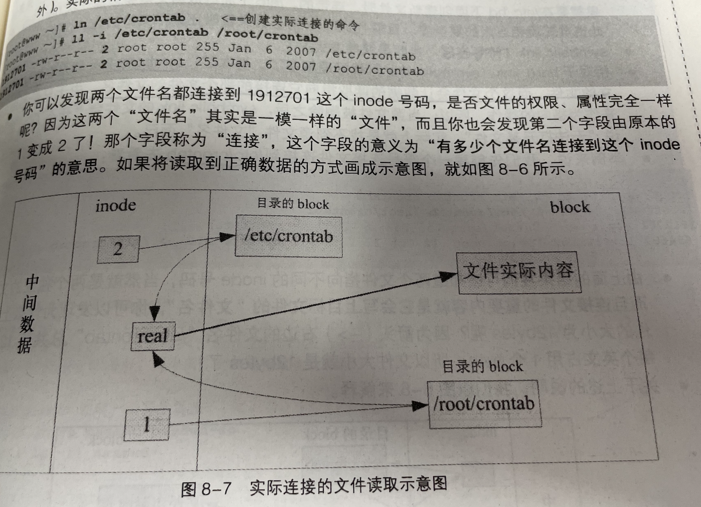
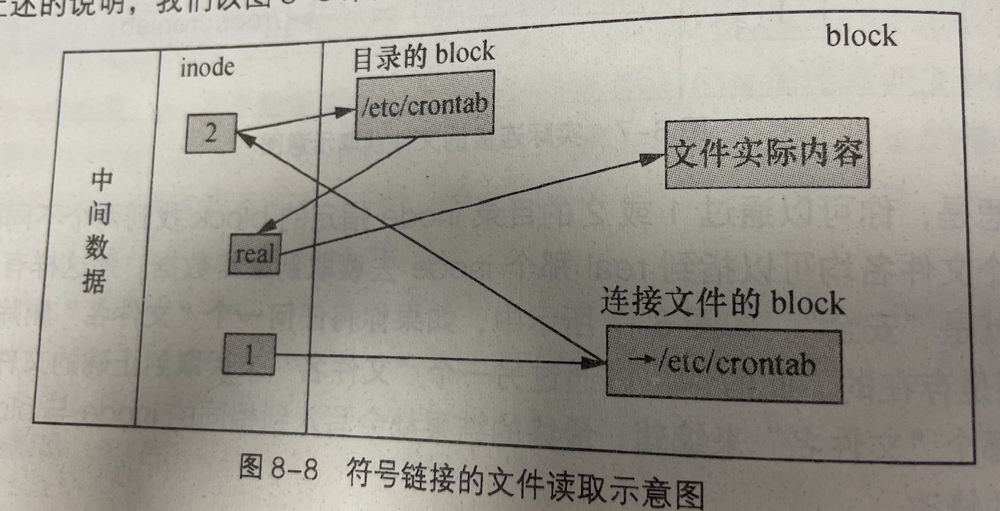
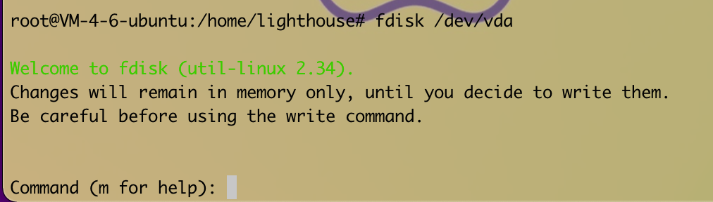

# EXT2文件系统

## 8.1.2 文件系统特性

磁盘分区完毕后进行格式化。因为每种操作系统所设置的文件属性/权限并不相同，为了存放这些文件所需的数据，将分区格式化成为操作系统能利用的文件。

一个可被挂载的数据为一个文件系统而不是一个分区。

文件系统将权限与属性放置到inode中，实际数据放置到data block块中。还有个superblock会记录整个文件系统的整体信息。

- super block：记录此文件系统的整体信息。
- inode：记录文件属性
- block：实际记录文件的内容

Linux的Ext2采用的是索引式文件系统。FAT文件系统需要经常碎片整理一下。

## 8.1.3 Ext2文件系统（inode）

Ext2文件系统在格式化的时候基本上是区分多个块组（block group）的，每个块组都有自己独立的inode/block/superblock系统。

在整体规划中，文件系统最前面有一个启动扇区（boot sector），这个启动扇区可以安装引导装载程序。能够将不同的引导装载程序安装到个别的文件系统的最前端，而不用覆盖整块硬盘唯一的MBR

- data block （数据块）
  - 支持的block大小有1kb，2kb，4kb三种。格式化时block大小就固定了

- inodetable（inode表格）
- superblock（超级块）
- File system Description（文件系统描述说明）
- block bitmap（块对照表）
  - 可以知道哪些block是空的，记录block是否为空
- inode bitmap（inode对照表）
  - 记录使用和未使用的inode的号码

## 8.1.4 与目录树的关系

目录与文件如何记录数据

目录

- 新建目录时，会分配一个inode和至少一块block。inode记录目录相关权限与属性，和分配到的block号码。block记录目录下文件名与该文件名占用的inode号码数据。

文件

- 新建一个文件时，会分配一个inode与相对于该文件大小的block数量给予该文件。

目录树读取

- inode本身并不记录文件名，文件名记录在目录的block当中。
- 目录树是由根目录开始读起，因此系统通过挂载的信息可以找到挂载点的inode号码，此时就能够通过根目录的inode内容，并根据该inode找到根目录的block内的文件名数据，在一层层往下读到正确的文件名 

## 8.1.5 日志文件系统

将inode table 与 data block 称为数据存放区域，至于其他例如super block、 block bitmap、inode bitmap等区段就被称为**metadata（中间数据）**。

为了避免文件不一致的情况（meta data的内容与实际数据存放区产生不一致的情况），在文件系统中规划出一个块，专门记录写入或修订文件时的步骤。

1、预备：当系统要写入一个文件时，会现在日志记录块中记录某个文件准备要写入的信息

2、实际写入：开始写入文件的权限与数据；开始更新meta data的数据

3、结束：完成数据后与meta data的更新后，日志记录块当中完成该文件的记录

## 8.1.7挂载的意义

**将文件系统与目录树结合的操作，称为挂载**

挂载点一定是目录，该目录为进入该文件系统的入口。

# 文件系统的简单操作

## 8.2.1 磁盘与目录的容量df du

- df：列出文件系统的整体磁盘使用量

~~~ 
df [-ahikHTM] [目录或文件名]
-h:以人们较易阅读的GB、MB、KB等格式自行显示出
-i:不用硬盘容量，而以inode的数量来显示
~~~

主要读的数据几乎都是针对整个文件系统，因此读取的范围主要是在Super block内的信息，显示结果快。

- du：评估文件系统的磁盘使用量（常用于评估目录所占容量）

~~~ 
du [-ahskm]文件或目录名称
-h：以人们较易读的容量格式（G/M）显示
-s：列出总量而已，而不列出每个个别的目录占用总量

du -sm /*
# 这是个很常用的功能：利用通配符*来代表每个目录。
~~~

会直接到文件系统内去查找所有的文件数据。

## 8.2.2 连接文件：ln

分为两种：一种类似于windows的快捷方式功能的文件，快速连接到目标文件（或目录）；另一种则是通过文件系统的inode连接来产生新文件名，而不是产生新文件。

### hard link

- hand link 只是在某个目录下新建一条文件名连接到某inode号码的关联记录而已。

~~~
ln /etc/corntab		<==创建实际的连接命令
~~~

不管使用哪个“文件名”来编辑，最终的结果都会写入到相同的inode与block中，因此均能进行数据的修改。

- 不能跨文件系统
- 不能连接到目录
  - 目录的inode记录目录相关权限与属性，和分配到的block号码。
  - 连接的数据需要连同被连接目录下吗的所有数据都建立连接。

### synbolic link（符号链接，快捷方式）

synbolic link就是在创建一个独立的文件，而这个文件会让数据的读取指向他连接的那个文件的文件名。

当源文件被删除之后，symbolic link的文件会“开不了”，实际上就是找不到源文件“文件名”而已。

链接文件的重要内容就是它会写上目标文件的“文件名”

~~~
ln [-sf] 源文件 目标文件
-s：如果不加任何参数就进行连接，那就是hard link，加上-s就是symbolic link
-f：如果目标文件存在，就主动将目标文件删除
~~~

# 磁盘的分区、格式化、检验与挂载

## 磁盘分区

~~~
fdisk [-l] 设备名称
-l：输出后面接的设备所有的分区内容。

fdisk -l	查阅目前系统内的所有分区有哪些。
~~~

设备名不要加上数字，因为飞去是针对“整个硬盘设备”而不是某个分区。

~~~ 
fdisk 设备名称
~~~

会进入Linux的fdisk系统

## 磁盘格式化

mkfs（make file system的意思）

~~~ 
mkfs [-t 文件系统格式] 设备文件名
~~~

-t：可以接文件系统格式，例如ext3，ext2，vfat等

## 磁盘检验：fsck，badblocks

## 磁盘挂载与卸载

- 单一文件系统不应该被重复挂载在不同的挂载点（目录）中
- 单一目录不应该重复挂载多个文件系统
- 作为挂载点的目录理论上应该都是空目录

~~~ 
mount [-t 文件系统][-L Label名][-o 额外选项] [-n] 设备文件名 挂载点
~~~

将文件挂载需要使用mount这个命令

~~~ 
范例1:用默认的方式将刚才创建的 /dev/hdc6 挂载到 /mnt/hdc6上
mkdir /mnt/hdc6
mount /dev/hdc6 /mnt/hdc6
~~~

 利用mount 设备名 挂载点

就可以挂载成功。

~~~ 
2、查看目前已挂载点文件系统，包含各文件系统的label名称
mount -l
~~~

将设备文件卸载（umount）

~~~ 
umount [-fn] 设备文件名或挂载点
-f：强制卸载，可用在类似网络文件系统（NFS）无法读取的情况下
-n：不更新/etc/mtab的情况下卸载
~~~

## 设置开机挂载

在/etc/fstab及/etc/mtab

### 特殊设备 loop挂载

- 挂载光盘/DVD镜像文件
  - 可以通过loop这个设备来挂载
- 新建大文件以制作loop设备文件

## 内存交换空间（swap）的构建

swap的功能就是在应付物理内存不足的情况下所造成的内存扩展记录的功能。cpu所读取的数据都来自内存，当内存不足的时候，为了能让后续的程序可以顺利运行，因此在内存中暂时不使用的程序与数据就会被挪到swap中了。（挪到外存中）

如果没有构造swap，可以创建虚拟内存文件

- 设置一个swap分区
- 创建一个虚拟内存文件

### 使用物理分区构建swap

### 使用文件构建swap

部署服务器是
